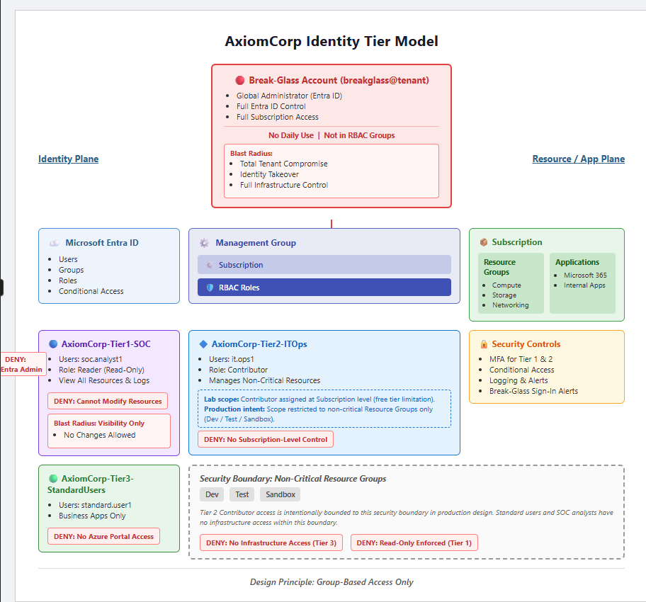

# Azure Entra ID - Identity Threat Modelling & Access Control Lab

## Overview

This project simulates the identity security posture design for a 
fictional financial services organisation, AxiomCorp, migrating 
workloads to Microsoft Azure. It demonstrates the design, 
implementation, and threat modelling of a tiered identity 
architecture using Microsoft Entra ID.

The focus is not on tutorial-level configuration but on the 
security rationale behind each decision: why each access tier 
exists, what the blast radius of a compromise looks like at 
each tier, and how identity controls map to real-world attack 
techniques documented in the MITRE ATT&CK framework.

This project forms the identity and access layer of a two-part 
Azure SOC lab. The access tiers and accounts designed here are 
actively monitored in the linked Detection Engineering Lab, 
where KQL detections alert on attacks against this identity 
architecture.

---

## Scenario

AxiomCorp is a small UK-based financial services firm in the 
early stages of an Azure migration. The security team has been 
tasked with designing a least-privilege identity architecture 
before any production workloads are migrated. This lab 
documents that design, its implementation in Microsoft Entra ID, 
and the threat model underpinning every access decision.

---

## Architecture

### Identity Tier Model

The architecture follows a four-tier model based on the 
principle of least privilege and blast radius containment:

| Tier | Group | Role | Scope |
|---|---|---|---|
| Tier 0 | AxiomCorp-Tier0-BreakGlass | Global Administrator | Full tenant - emergency use only |
| Tier 1 | AxiomCorp-Tier1-SOC | Reader | Subscription scope |
| Tier 2 | AxiomCorp-Tier2-ITOps | Contributor | Subscription scope (lab) / Non-critical RGs (production) |
| Tier 3 | AxiomCorp-Tier3-StandardUsers | None | No Azure Portal access |

**Design principle: group-based access assignment only.**
No permissions are assigned directly to individual user accounts. 
All access is controlled via security group membership, enabling 
immediate revocation by removing a user from their group.

---

## Security Controls Implemented

### Identity & Access
- Four-tier RBAC model enforcing least privilege at each level
- Security group-based role assignment across all tiers
- Break-glass account isolated from daily operations with no 
  permanent RBAC group membership
- Reader-only access for SOC analysts, full visibility, 
  zero write capability

### Authentication
- Per-user MFA enforced on Tier 1 SOC analyst account
- MFA registration tested and verified via private session login
- Mitigates MITRE T1110 (Brute Force) and T1078 (Valid Accounts)

### Policy Design (Production Intent)
Three Conditional Access policies have been designed for 
production deployment. These require a P1 licence and are 
documented as specifications in this lab:
- Block legacy authentication across all users
- Require MFA for Tier 1 and Tier 2 outside UK IP ranges
- Block high-risk sign-ins using Entra ID Protection (P2)

Full specifications: [policies/conditional-access-design.md](policies/conditional-access-design.md)

---

## Threat Model

Every access decision in this architecture was made against 
a defined threat model. The blast radius analysis documents 
the realistic impact of a credential compromise at each tier:

| Tier | Severity if Compromised | Write Access | Privilege Escalation | Detection Speed |
|---|---|---|---|---|
| Tier 0 Break-Glass | Critical | Full tenant and infrastructure | N/A | Immediate |
| Tier 1 SOC Analyst | Medium | None | Not possible | Moderate |
| Tier 2 IT Ops | High | Resources only | Not possible via RBAC | Fast to Moderate |
| Tier 3 Standard User | Low (Azure) | None | Not possible | Slow |

Full analysis: [threat-model/blast-radius-analysis.md](threat-model/blast-radius-analysis.md)

---

## MITRE ATT&CK Mapping

Each control implemented maps to one or more MITRE ATT&CK 
techniques. Selected highlights:

| Control | Technique | ID |
|---|---|---|
| Tiered RBAC with least privilege | Valid Accounts | T1078 |
| Reader-only for SOC analysts | Valid Accounts: Cloud Accounts | T1078.004 |
| MFA on privileged accounts | Brute Force | T1110 |
| MFA on privileged accounts | Phishing | T1566 |
| No permanent Global Admin | Account Manipulation | T1098 |
| Block legacy auth (design) | Valid Accounts | T1078 |
| Tier 3 assigned no Azure roles | Permission Groups Discovery | T1069.003 |

Full mapping including residual risks: 
[mitre-mapping/attack-mapping.md](mitre-mapping/attack-mapping.md)

---

## What I Would Add in Production

This lab was built on the Azure free tier. The following 
controls were designed but not enforced due to licensing 
constraints, and represent the next layer of hardening in 
a production environment:

**Conditional Access enforcement (P1)**
Full enforcement of the three policies documented in 
`policies/conditional-access-design.md`, particularly 
blocking legacy authentication as the highest-priority 
baseline control.

**Privileged Identity Management (P2)**
Rather than permanent role assignments, PIM would provide 
just-in-time privileged access with time-limited elevation, 
approval workflows, and full audit logging. This is 
particularly important for Tier 0 and Tier 2 accounts.

**Entra ID Protection (P2)**
Real-time sign-in risk scoring using Microsoft's global 
threat intelligence. Would feed directly into the 
high-risk sign-in block policy and surface compromised 
credentials before a successful authentication occurs.

**Resource Group scoping for Tier 2**
In this lab, Contributor is assigned at subscription scope 
due to free tier constraints. In production, this would be 
scoped strictly to non-critical resource groups 
(Dev / Test / Sandbox) to limit blast radius significantly.

---
